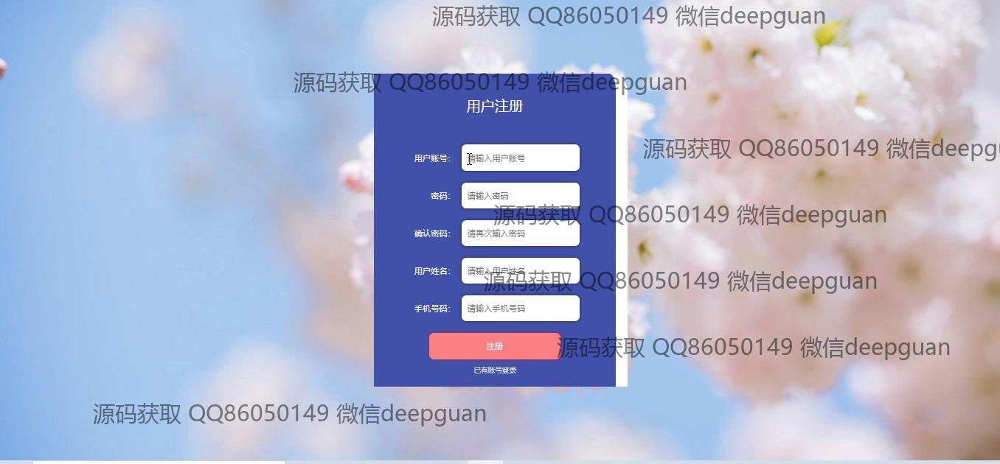
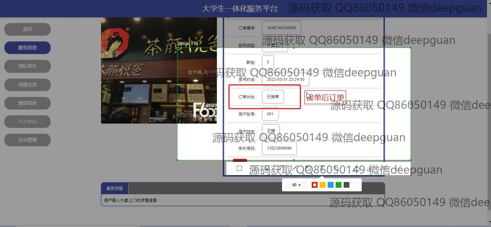

<h1 align="center">基于web的大学生一体化服务平台的设计与实现</h1>

## 简介
基于Spring Boot的大学生一体化服务平台，角色涵盖管理员、用户、司机和商家，功能包括用户及司机管理、兼职招聘管理、拼车信息管理、闲置交易管理和服务信息管理，平台设计简洁，支持多种服务体验。    --计算机毕业设计源码；毕设源码；java毕业设计源码

## 联系方式

<h3 align="center">获取完整代码与数据库文件 + 微信：deepguan QQ: 86050149 QQ群: 783742310</h3>

<h3 align="center">可帮忙远程部署 包运行成功！提供远程部署、修改代码、设计文档指导、代码讲解等服务！</h3>

## 功能介绍（完整见运行截图）
用户：用户可以通过登录或注册访问平台，参与服务，包括在线选课、成绩查询、兼职信息查看以及拼车信息的管理等。用户能够在“个人中心”进行个人信息的查看与更新，也可以管理自己的订单、地址和服务记录。平台还提供物品交易功能，用户可以上传商品、编辑信息、查看闲置商品详情并在平台上完成交易。此外，用户可以使用导航栏快速访问不同服务模块，有效提升总体使用效率。

商家：商家在平台上不仅可以注册成为用户，还可以发布和管理自己的服务和商品，如兼职岗位的信息，包括职位描述、薪资待遇、工作时间等。商家有能力审核和下载用户简历，管理招聘信息，查看申请者详情，并使用分页工具快速浏览大量数据。平台为商家提供了完善的管理工具，提升岗位候选者的审核及处理效率。

司机：司机能够通过平台注册并管理自己的拼车信息，他们可以输入和更新车辆信息，包括出发地、目的地、费用、车牌号及联系方式等。此外，司机能够通过导航菜单访问“团队拼车管理”或“拼车信息管理”模块，编辑拼车相关信息，用户还可以为司机提供反馈，进一步完善拼车服务。

管理员：管理员通过访问后台管理模块，实现对用户、司机、商家和各类信息的全面管理。管理员可以使用多种筛选和搜索功能，像按岗位名称、用户姓名等，快速访问任意数据模块，还具备批准或删除不当内容的功能。管理员同时负责内容审核确保平台内容合规，保障平台的整体运营，以及协调各角色的正常使用。

## 运行截图

本代码来源于网络,仅供学习参考使用!

